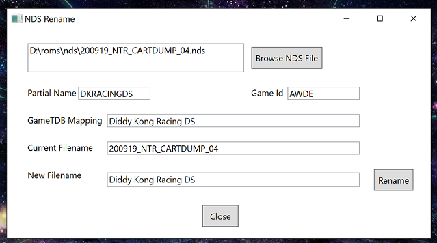

# NDSRename

[Latest Release](https://github.com/Clockwork-Creep/NDSRename/releases/tag/v1.0.1)

### Overview

***NDSRename*** is a Windows GUI tool for inspecting and resolving Nintendo DS (.nds) game names. When a cartridge is dumped using GodMode9 the name of the binary file will not include the game. 

This tool will:
  1. load the metadata header
  2. extract the game id
  3. resolve the game title in the GamesTDB database
  4. allow you to rename the file to the resolved title and/or provide your own

